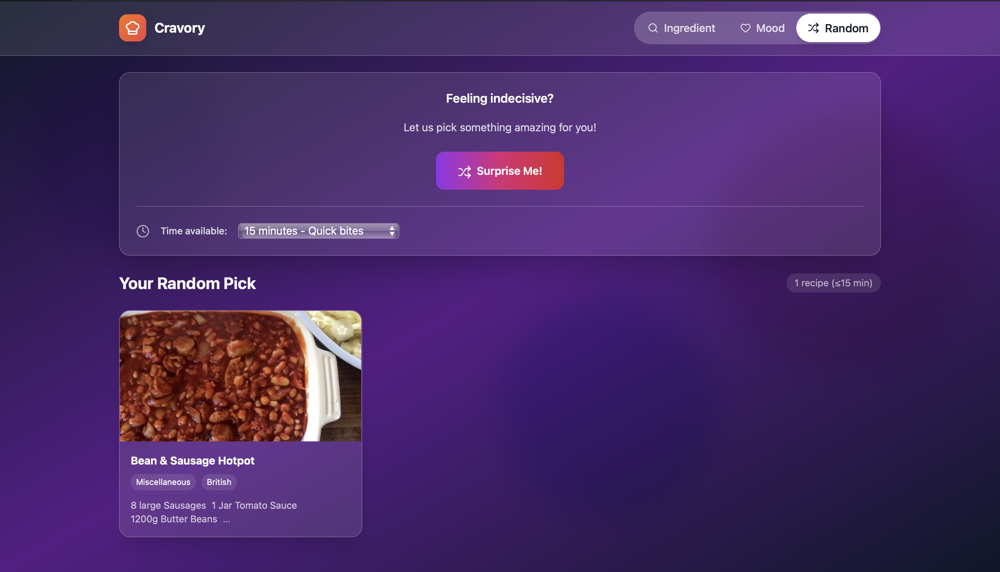

# Cravory - Your Ultimate Recipe Companion

## Overview

**Cravory** is a modern, interactive recipe app that helps users discover meals based on ingredients they have, their mood, or even a random surprise. Built with **React**, **TypeScript**, and **TailwindCSS**, Cravory combines smooth animations, a sleek interface, and API-driven recipe data to make cooking fun and effortless.

Key features include:  
- **Ingredient-based search** to find recipes using what you have in your kitchen.  
- **Mood-based discovery** to match meals with your current craving or mood.  
- **Random recipe generator** to surprise users with new dishes.  
- **Recipe details** with ingredients, instructions, and optional video tutorials.  

<p align="center">

</p>

---

## Features

- **Ingredient Search**:  
  Enter ingredients and get recipes that use them, complete with step-by-step instructions.

- **Mood-based Recipes**:  
  Select your mood (Comfort, Healthy & Fresh, Spicy, Sweet, International, Quick & Light) and explore curated recipes.

- **Random Recipe**:  
  Feeling indecisive? Let Cravory suggest a unique meal for you.

- **Time Filter**:  
  Filter recipes based on how much time you have available (15 min, 30 min, 1 hour, or Any time).

- **Favorites**:  
  Save your favorite recipes to revisit them quickly.

- **Recipe Details & Video Tutorials**:  
  View detailed instructions, ingredients, and YouTube tutorials if available.

- **Modern UI & Animations**:  
  Smooth transitions, animated pan on landing page, and interactive recipe cards.

---

## Requirements

### Software Requirements:
- **Node.js** (Latest LTS version)  
- **React & TypeScript**  
- **TailwindCSS** (CSS framework)  
- **Optional**: Access to [TheMealDB API](https://www.themealdb.com/)  

---

## Setup Instructions

### Step-by-Step Setup

1. **Clone the Repository**
```bash
npm install
```

2. **Install dependencies:**
    ```bash
    python -m venv .venv
    ```
3. **Start the Development Server:**
```bash
    npm run dev
```
4. ** Open in browser:**
   ```bash
   The app will be available at http://localhost:5173
   ```
Ingredient Search
<p align="center">  </p>
Mood-based Recipes
<p align="center">  </p>
Recipe Details
<p align="center">  </p>
Suprise Me page
<p align="center">  </p>
